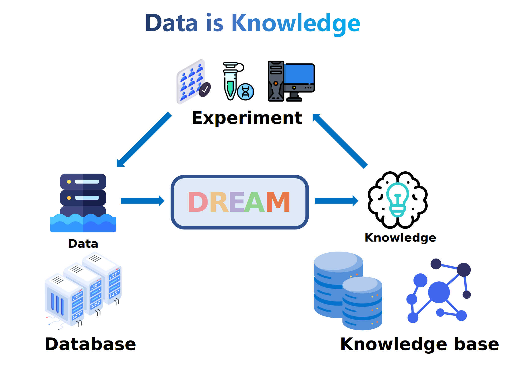
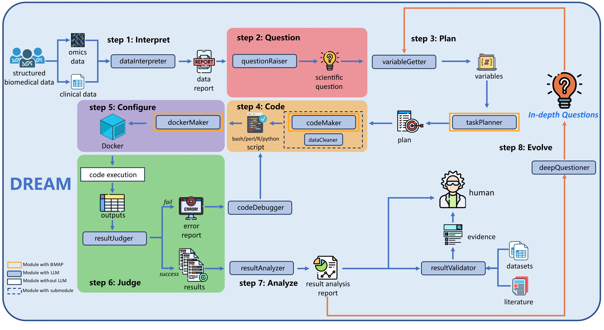

# DREAM

DREAM is the first **D**ata-d**R**iven self-**E**volving **A**utonomous  research syste**M**, providing an efficient and reliable solution for future biomedical research and other data-driven fields. [[Paper Link](https://arxiv.org/abs/2407.13637)]

## :alarm_clock: News

* Regarding the DREAM code, we are currently preparing for the code release, which will be available soon!
* We have already made public the code examples generated by DREAM for answering its own proposed questions.

## :computer: Architecture

## :stars: Motivation

* In contemporary biomedical research, the efficiency of data-driven approaches is hindered by large data volumes, tool selection complexity, and human resource limitations, necessitating the development of fully autonomous research systems to meet complex analytical needs. 
* So we developed DREAM, the first biomedical data-driven self-evolving autonomous system, which can independently conduct scientific research without any human involvement.

## :floppy_disk: Data

* The  Framingham heart study dataset for the data used in the clinical analysis is in the 'data' folder.
* Please check the [GSE209609](https://www.ncbi.nlm.nih.gov/geo/query/acc.cgi?acc=GSE209609) for the gene expression data used in the omics analysis.

